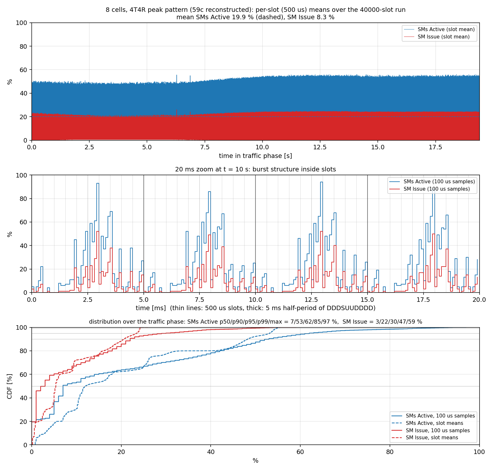

# 멀티셀 부하 시나리오: 로컬 TV로 복원한 4T4R 패턴과 GPU 부하 측정

2026-09-11, GH200 (132 SM), Aerial 25-3, loopback RU emulator (aerial02 ↔ aerial03, 200 GbE).

## 왜 필요한가

nrSim 90063(1셀, 기능 시험용 TV)은 cuPHY가 GPU의 **평균 5 %, 100 µs 피크 15 %**만 쓴다.
mMIMO 패턴 69는 1셀에서 피크 57 %까지 올라가지만, 이 서버의 RU 에뮬레이터는 MMIMO 코어
요구(39 isolated cores)를 못 채워(`isolcpus=4-64`, DU가 4–32 사용 → 32개 남음) UL이 죽는다.
그래서 **4T4R 셀을 여러 개** 돌리는 쪽을 택했다. 4T4R loopback 코어 배치(DU 4–19, RU 20–42)는
nrSim과 같아서 추가 설정이 없다.

## 로컬 TV에서 발견한 것

`testVectors/`에는 DLMIX 13478개, ULMIX 8048개가 있고 그중 **4T4R이 DL 7364 / UL 3393**개다
(`prof/tv_classes.csv`, `Cell_Config.numTxAnt`로 분류). 4T4R id는 큰 연속 블록으로 놓여 있다:

| 블록 | id 범위 | 크기 | 구조 |
|---|---|---|---|
| DL peak | 9472–10271 | 800 | 40 slot-config × 20 cells |
| DL avg  | 10452–11251 | 800 | 40 × 20 (PDSCH 312–528 PRB·layer) |
| DL peak | **11432–12231** | 800 | 40 × 20, PDSCH 6 UE, 273 PRB × 4 layers, MCS 27, ~124–134 kB/slot, SSB(0–7)·CSI-RS(8–21,24–37)·PDCCH |
| UL peak | **5971–6370** | 400 | 20 × 20, PUSCH 6 UE ≤ 273 PRB × 2 layers, ~36–73 kB/slot, PUCCH 36–108, PRACH |
| UL | 4911–5430, 4471–4790 | 520, 320 | 26×20, 16×20, 더 가벼움 |

id 배치는 출하된 69 패턴과 같은 규칙이다: `id(slot_config s, cell c) = base + stride·s + c`
(69는 stride 15, 4T4R는 20). 셀마다 `phyCellId`가 41, 42, …로 이어진다. 즉 **TV는 다 있고
launch_pattern yaml만 없다.** 4T4R ULMIX에 SRS PDU는 없다.

## 패턴 복원

[tools/make_launch_pattern_4t4r.py](../tools/make_launch_pattern_4t4r.py)가 DDDSUUDDDD(mu=1, 40슬롯)
스케줄을 만든다. DL 슬롯 32개에 DL 블록의 40개 config를 순서대로, UL 슬롯 8개에 UL 블록 config
4–11(PUCCH 36/108, PRACH 포함)을 배정한다. S 슬롯은 PDSCH만 싣는다(SRS TV 없음).

```bash
python3 cuPHY-CP/dapp_hook/tools/make_launch_pattern_4t4r.py --cells 8 --name 59c --out testVectors --tv-dir testVectors
```

→ `testVectors/launch_pattern_F08_8C_59c.yaml`. 이름을 59c(공식 4T4R peak 패턴, 파일만 없음)로
두면 `test_config.sh 59c`와 run 스크립트가 그대로 받아들인다.

## 실행 (phase4 스크립트)

```bash
# 1) 한 번: F08_CG1 4T4R loopback 설정
docker exec -u root c_aerial_troy bash -lc 'cd /opt/nvidia/cuBB/testBenches/phase4_test_scripts && ./setup1_DU.sh --ru-host-type=_LOOPBACK --du-eth0=aerial02 -y F08_CG1 && ./setup2_RU.sh --ru-eth0=aerial03'
# 2) 셀 수 선택 (test_config.sh의 --force는 한 번 걸러 TEST_VARS를 잃어버리므로 summary에서 지우고 다시 돌리는 게 확실함)
python3 - <<'EOF'
p="testBenches/phase4_test_scripts/test_config_summary.sh"
tv=set("PATTERN PATTERN_MODE CHANNELS NUM_CELLS NUM_PORTS TEST_SLOTS WORK_CANCEL_MODE WC_MODE BFP EARLY_HARQ_ENABLED EHQ_STATUS DEVICE_GRAPH_LAUNCH_ENABLED DGL_STATUS USE_GREEN_CONTEXT GC_STATUS PMU_METRICS STT DLC_TB_ENABLED ML2_CELL_MASK0 ML2_CELL_MASK1 ML2_CELL_LIST0 ML2_CELL_LIST1 TESTMAC1_YAML TEST_CONFIG_DONE".split())
out=[]
for l in open(p).read().splitlines():
    if l.startswith("VARS="): l=l.split(" PATTERN")[0].rstrip('"')+'"'
    elif l.split("=")[0] in tv: continue
    out.append(l)
open(p,"w").write("\n".join(out)+"\n")
EOF
docker exec -u root c_aerial_troy bash -lc 'cd /opt/nvidia/cuBB/testBenches/phase4_test_scripts && ./test_config.sh 59c --num-cells=8 --num-slots=40000'
sed -i 's/export_dl: 0/export_dl: 1/' cuPHY-CP/cuphycontroller/config/l2_adapter_config_F08_CG1.yaml   # dApp 링에 DL도 내보내려면
# 3) 평소대로 run1_RU.sh → run2_cuPHYcontroller.sh → run3_testMAC.sh
```

`test_config.sh`는 tracked 파일(`l2_adapter_config_F08_CG1.yaml`, `ru-emulator/config/config.yaml`,
`test_mac_config.yaml`, `nvlog_config.yaml`)을 다시 쓰므로 실험 뒤 `git checkout --`로 되돌린다.
nrSim으로 돌아가려면 `setup1_DU.sh … -y nrSim_SCF_CG1_90063`, `setup2_RU.sh`, `test_config_nrSim.sh`.

## 결과 (testMAC 40000슬롯, nsys GPU 메트릭 100 µs, 트래픽 구간만)

모든 실행에서 testMAC 전 셀 `ERR 0`, 셀당 DL 1544 Mbps / UL 197 Mbps.

| 셀 | SMs Active 평균 | p50 | p90 | p95 | p99 | max | 슬롯(500 µs) 평균 p50 / p90 / max | SM Issue 평균 / p95 / max | L1 드롭 | RU late DL slots |
|---|---|---|---|---|---|---|---|---|---|---|
| nrSim 90063 (참고) | 4.8 % | 3 | – | 12 | 12 | 15 | – | 1.2 / 2 / 3 | 0 | 0 |
| 1 | 6.3 % | 1 | 21 | 26 | 35 | 45 | 3.8 / 17 / 20 | 1.3 / 4 / 10 | 0 | 0 |
| 4 | 11.8 % | 4 | 33 | 43 | 65 | 75 | 6.4 / 31 / 38 | 4.2 / 16 / 36 | 0 | 8/셀 |
| 8 | 19.9 % | 7 | 53 | 62 | 85 | 97 | 12.0 / 48 / 56 | 8.3 / 30 / 59 | 0 | 8/셀 |
| 16 | 36.2 % | 23 | 80 | 90 | 97 | 100 | 31.0 / 70 / 81 | 16.7 / 51 / 67 | **2** | 72/셀 (0.2 %) + PDSCH payload 검증 오류 1슬롯 |



읽는 법: SMs Active는 100 µs 창에서 warp가 상주한 SM 비율(GPU 점유), SM Issue는 실제 명령어
발행률(연산 강도). 8셀에서 UL 슬롯은 T0+750 µs에 56 %, DL 슬롯은 20–29 %로 톱니를 그린다
(`tools/gpu_slot_profile_from_nsys.py`). 16셀은 슬롯 평균 p90이 70 %라 YOLO에 줄 SM이 슬롯마다
크게 달라지는, 스케줄러 실험에 가장 쓸모 있는 구간이지만 L1이 이미 슬롯 2개를 떨어뜨리고
RU 에뮬레이터도 늦기 시작한 경계 상태다.

**권장**: 안정 실험은 **8셀**(평균 20 %, 슬롯 피크 56 %, 드롭 0), 스트레스는 16셀. 셀 수와
DL/UL 블록(peak ↔ avg 10452)을 바꾸면 부하를 단계적으로 조절할 수 있고, 예측기 학습 데이터도
같은 방법으로 만들면 된다 (`--dl-base 10452`가 평균 부하, 셀 수로 스케일).

## 주의

- 100 µs 샘플이라 순간 점유는 표보다 높다. 커널 단위 시각은 label_points.md의 이벤트 경로로 잰다.
- 트래픽 구간은 testMAC 로그의 시작/`Finished running` 시각으로 잘랐다(nsys 창이 부분만 겹쳐도
  통계는 그 구간만).
- `pkill -x cuphycontroller_scf`는 절대 잡히지 않는다. 커널이 보는 comm은 `phy_main`이다.
  nsys로 띄운 L1은 nsys가 끝나도 살아남으므로 다음 실행 전에 `pkill -x phy_main`으로 정리해야
  MPS 재시작이 안 걸린다.
- `INV 2400`은 testMAC이 초기 2400개 UCI(CSI)를 invalid로 센 것으로 이후 늘지 않는다.
  nrSim 90063에서는 0이다. 라벨 수집에는 영향 없지만 원인은 확인하지 않았다.
